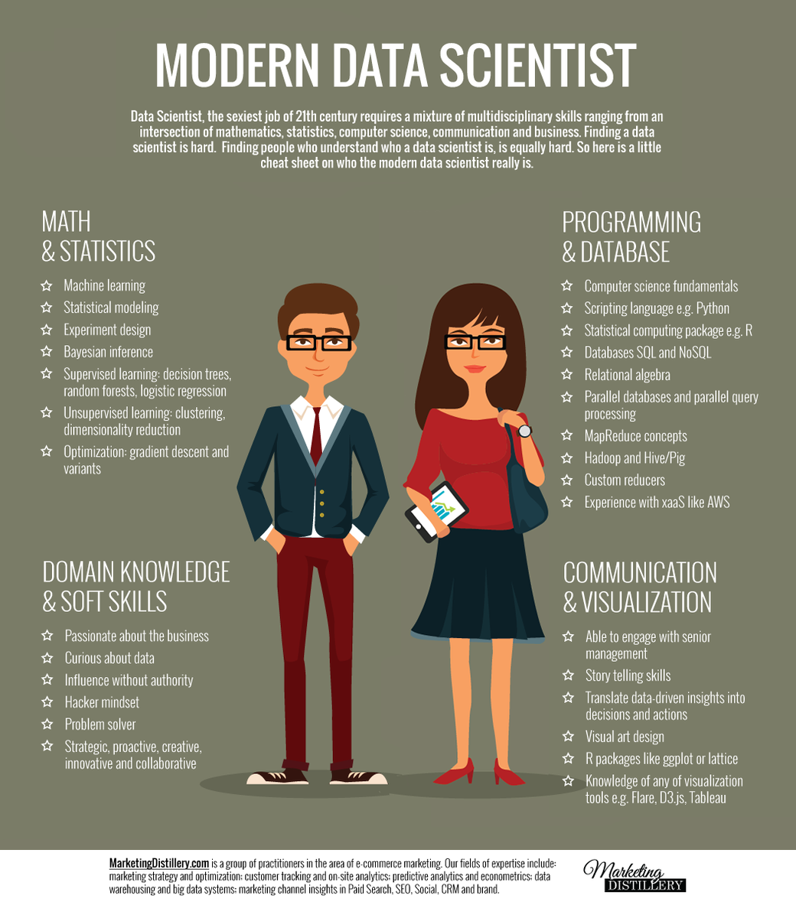
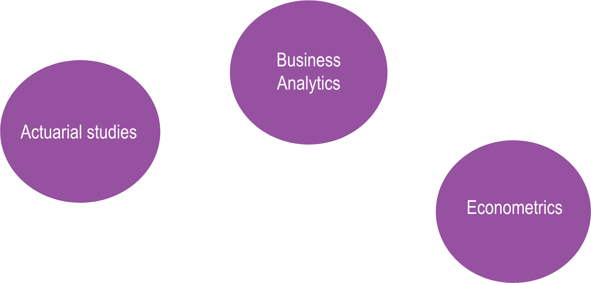
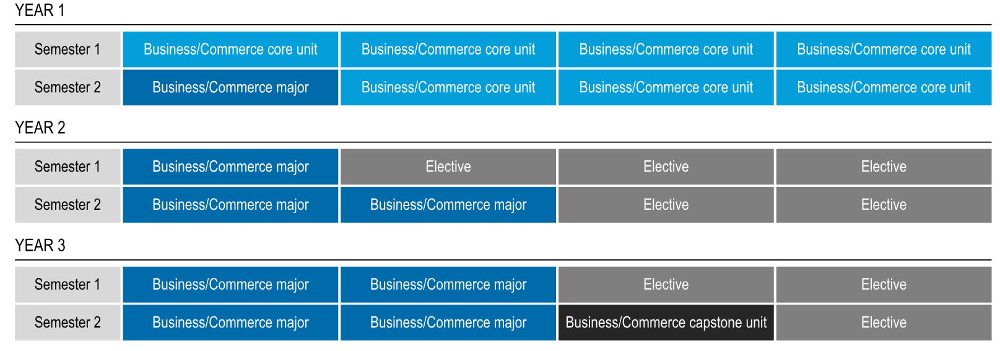
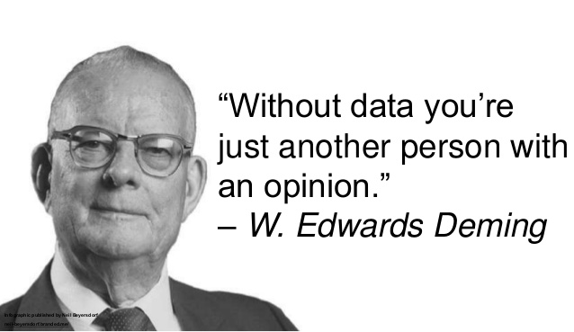

```{r initial, echo = FALSE, cache = FALSE, results = 'hide'}
library(knitr)
options(htmltools.dir.version = FALSE, tibble.width = 60, tibble.print_min = 6)
opts_chunk$set(
  echo = FALSE, warning = FALSE, message = FALSE, comment = "#>",
  fig.path = 'figure/', cache.path = 'cache/', fig.align = 'center',
  fig.width = 12, fig.height = 11, fig.show = 'hold',
  cache = TRUE, external = TRUE, dev = 'svglite'
)
```


# What is business analytics?

* Business analytics is driven by the big data revolution
* "Big data" refers to the magnitude and complexity of data now being collected and made available
* It is equivalently called  "data science" with a focus on business and economic data
* Business analysts extract information from data
* Today the ability to wrangle, visualise and analyse data is a life skill as important as reading and writing

---


.pull-left[
## What is a data scientist?

- mix of multidisciplinary skills
- machine learning, statistical modelling
- Curious about data, hacker mindset, problem solver
- Scripting languages like R
- R packages like ggplot2, story-telling skills
]

.pull-right[

```{r, out.width = "550px", fig.align='left'}

```
.small[Infographic courtesy of [Marketing Distillery](https://www.themarketingdistillery.com)]

]

---
# Related Majors in B. Commerce


```{r, out.width = "900px", fig.align='center'}

```

---
# Course structure


```{r, out.width = "1200px", fig.align='center'}

```

- Major = 48 points, minor = 12 points

---
# Business analytics major

- Core classes
    - ETC1010: Data Modeling and Computing
    - ETC2420: Statistical Thinking with Randomization and Simulation
    - ETC3250: Business Analytics
- Electives
    - Econometrics and Business Statistics: data visualisation, forecasting, advanced statistical modeling, advanced statistical learning, high-dim data analysis
    - Other departments and faculties: algorithms and data structures, market research analysis, databases, data visualisation, advanced data analysis, business intelligence

Find out more by searching on these key words [Business Analytics Monash](https://www.monash.edu/business/future-students/undergraduate-study-options/bachelor-of-commerce)

---
# Entry requirements

- Need to be admitted to Bachelor of Commerce
- 2018 entry:
    - 90.35 "clearly in" ATAR
    - 80.85 lowest ATAR offer
    - will probably rise for 2019 intake
- Prequisites (domestic)
    - Math: Units 3 & 4: a study score of at least 25 in Mathematical Methods (any) or Specialist Mathematics
    - English: Units 3 & 4: a study score of at least 30 in English (EAL) or 25 in English other than EAL

---
# What’s special about Monash?

- Our major is accredited by the Statistical Society of Australia, giving graduates a Graduate Statistician (GStat) qualification  - the only one in Australia
- The Monash Business Analytics Team is a group of internationally renowned researchers
- Close connections with leaders, developers and employers across the globe for employment and internship opportunities
- Our courses are cutting edge, focusing on problem solving and hands-on experience
- Program is fiercely independent, not sponsored by any software company, to be able to teach students the top tools regardless of the source
- Monash Business School ranked 7th in the world in econometrics and 14th in the world in forecasting.

---
# Job prospects

[Career Cast Jobs Rated](https://www.careercast.com/jobs-rated/2018-jobs-rated-report)

Data scientist has been rated in the top 10 jobs in the last several years
- Median salary $USD110-120k
- Increasing opportunities - projected growth 19%
- Good working environment and very low stress

Statistician (and mathematician) have been rated in top 10 jobs in the last several years
- Median salary $USD80-85k
- Increasing opportunities - projected growth 33%
- Good working environment and very low stress

---
# Best jobs in the world

.pull-left[

1. Genetic counsellor
1. **Mathematician**
1. University Professor
1. Occupational Therapist
1. **Statistician**
1. Medical Services Manager
1. **Data Scientist**
1. Information Security Analyst
1. **Operations Research Analyst**
1. **Actuary**

]

.pull-right[

https://www.careercast.com/jobs-rated/2018-jobs-rated-report

```{r}

```

]

---
class: inverse center middle

# Questions?
